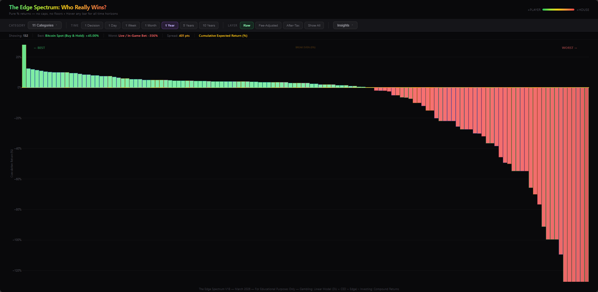
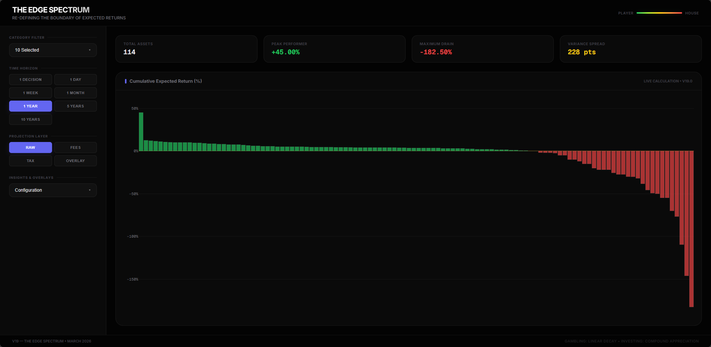

<p align="center">
  
  
  
  
  
</p>

<h1 align="center">The Edge Spectrum</h1>

<p align="center">
  <b>Who Really Wins?</b><br>
  <sub>An interactive visualization comparing expected cumulative returns of 167+ financial activities<br>
  — from index fund investing to casino gambling to lottery tickets — across 7 time horizons.</sub>
</p>

<p align="center">
  Every bar answers one question: <i>if you repeat this activity, does the math work for you or against you?</i>
</p>

---

## 📸 Screenshots

<table>
<tr>
<td width="33%" align="center">

**Original Theme**

`Versions/Original-Theme/V18.html`

</td>
<td width="33%" align="center">

**Dark Sidebar Theme**

`Versions/Dark-Sidebar-Theme/V1.html`

</td>
<td width="33%" align="center">

**Light Vertical Theme**
`Versions/Light-Vertical-Theme/V2.html`

</td>
</tr>
</table>

---

## 🚀 Quick Start

```bash
# No install, no build — just open in any modern browser
```

1. **Original Theme** — Open `Versions/Original-Theme/V18.html`
2. **Dark Sidebar** — Open `Versions/Dark-Sidebar-Theme/V1.html`
3. **Light Vertical** — Open `Versions/Light-Vertical-Theme/V2.html`
4. Use the **Category** dropdown to filter by activity type
5. Use the **Time Horizon** buttons to switch periods (1 Bet → 10 Years)
6. **Hover** any bar for a detailed breakdown and peer comparison

> [!NOTE]
> All charts are standalone HTML files. The only external dependency is Plotly.js loaded from CDN (internet connection required on first load).

---

## 🧮 How It Works

Each activity is assigned a **per-event edge** — the percentage advantage or disadvantage per bet, trade, or year of holding. Returns are projected using one of two models:

| Model | Used For | Formula |
|:------|:---------|:--------|
| **Compound** | Investing, crypto, metals, real estate | `((1 + annual_return)^years - 1) × 100` |
| **Linear (DU × CED)** | Casino, sports, poker, lottery | `DU_period × (CED / 100) × edge` |

- **DU** = Decision Units — how many bets/trades per time period (varies by activity)
- **CED** = Capital Exposure per Decision — % of bankroll risked per event (varies by activity)

> [!IMPORTANT]
> The linear model has **no floor** — losses can exceed -100% to show the true cumulative cost of repeated negative-edge bets over time.

### Time Horizons

| Horizon | Investing (Compound) | Gambling (Linear) |
|:--------|:---------------------|:------------------|
| 1 Bet / 1 Trade | 1 trading day (1/252 yr) | 1 event |
| 1 Day | 1 trading day | DU × 1 day |
| 1 Week | 1/52 year | DU × 7 days |
| 1 Month | 1/12 year | DU × 30 days |
| 1 Year | 1 year | DU × 365 days |
| 5 Years | 5 years | DU × 1,825 days |
| 10 Years | 10 years | DU × 3,650 days |

---

## 📊 Features

| Feature | Description |
|:--------|:------------|
| **13 Categories** | Stocks, Bonds, Real Estate, Crypto, Precious Metals, Collectibles, Insurance & Annuities, Sports Betting, Casino, Poker, Prediction Markets, Lottery |
| **Category Multi-Select** | Toggle any combination with color-coded dots and checkboxes |
| **3 Projection Layers** | Raw Returns, Fee-Adjusted, After-Tax — plus an overlay mode showing all |
| **7 Time Horizons** | 1 Bet → 10 Years, one click to switch |
| **Rich Tooltips** | Name, category, return badge, all-horizon grid, volatility, win probability, skill factor |
| **Dollar Cost Comparison** | Toggle $100/week projection to see dollar outcomes |
| **Addiction Risk Scoring** | 1–5 rating per activity with color-coded risk meters |
| **Adaptive Y-Axis** | 5th–95th percentile range with smart tick scaling |

---

## 📁 Project Structure

```
Betting_Spectrum/
├── README.md
├── Data/                          ← Raw edge data (Markdown tables)
│   ├── edge_analysis12.md         ← Current: 166 pts, 11 cats, DU/CED framework
│   ├── edge_analysis11.md         ← Streamlined 156 entries
│   ├── edge_analysis10.md         ← DU/CED standardization
│   ├── edge_analysis9.md          ← Complete 180-point dataset
│   └── Legacy/                    ← Archived V1–V8 data
├── Versions/                      ← Interactive HTML charts
│   ├── Original-Theme/
│   │   └── V18.html               ← Latest original zinc theme
│   ├── Dark-Sidebar-Theme/
│   │   └── V1.html                ← V19: Sidebar navigation redesign
│   ├── Light-Vertical-Theme/
│   │   ├── V1.html                ← V20: Light blue, vertical bars
│   │   └── V2.html                ← V21: Centered, hover-only labels
│   └── Legacy/                    ← Archived V11–V17
├── Docs/                          ← Changelog, ideas, analysis
│   ├── change_log.md
│   ├── improvement_ideas.md
│   └── GPT_Analysis/
└── Screenshots/
    └── App/
```

---

## 🎨 Theme Variants

| Theme | Version | Layout | Style |
|:------|:--------|:-------|:------|
| **Original** | V18 | Horizontal control bar, vertical bars | Dark zinc palette, frosted-glass tooltips |
| **Dark Sidebar** | V19 (V1) | Left sidebar navigation | Near-black with indigo accents |
| **Light Vertical** | V20 (V1) | Top control bar, horizontal bars | Light blue, full-width scrollable |
| **Light Vertical Centered** | V21 (V2) | Top control bar, centered chart | Light blue, hover-only labels, no y-axis text |

Each theme has its own subfolder under `Versions/` with independent version numbering.

---

## 📋 Categories & Edge Ranges

| Category | Model | Edge Range |
|:---------|:------|:-----------|
| Stock Market | Compound | +12.5% to -30% annual |
| Bond Market | Compound | +5.5% to +1.5% annual |
| Real Estate | Compound | +10% to -12% annual |
| Cryptocurrency | Compound | +45% to -70% annual |
| Precious Metals | Compound | +7.5% to +1.0% annual |
| Collectibles | Compound | +6% to -50% annual |
| Insurance & Annuities | Compound | +5% to +2% annual |
| Sports Betting | Linear | -4.55% to -35% per bet |
| Casino Gambling | Linear | -0.46% to -35% per bet |
| Poker & Skill-Based | Linear | +5% to -20% per bet |
| Prediction Markets | Linear | -3% to -10% per bet |
| Lottery & Scratch-Offs | Linear | -25% to -55% per bet |

---

<details>
<summary><b>📖 Data File History</b></summary>

### Current Data Files

| File | Key Changes |
|:-----|:------------|
| **edge_analysis12.md** | 166 data points, 11 categories, combined V10+V11 reference |
| **edge_analysis11.md** | Streamlined to 156 entries — removed Options, Active Trading |
| **edge_analysis10.md** | DU/CED framework replaces hardcoded position sizing |
| **edge_analysis9.md** | Complete 180-point dataset with all 7 horizons |

### Legacy Data (Data/Legacy/)

| File | Version | Key Addition |
|:-----|:--------|:-------------|
| edge_analysis.md | V1 | Original 99 activities |
| edge_analysis2.md | V2 | "$100 becomes..." time horizons |
| edge_analysis3.md | V3 | Pure % returns, no -100% floor |
| edge_analysis4.md | V4 | +23 stock indexes, +12 bond indexes |
| edge_analysis5.md | V5 | +5 trading, +5 poker, +5 lottery |
| edge_analysis6.md | V6 | Real Estate overhaul, collectibles |
| edge_analysis7.md | V7 | Fee-adjusted returns + tax impact layer |
| edge_analysis8.md | V8 | Time horizon overhaul (5 → 7) |

</details>

<details>
<summary><b>📜 Chart Version History</b></summary>

| Version | Key Changes |
|:--------|:------------|
| **V18** | Latest original zinc theme. 167 data points, Precious Metals added. |
| **V19** | Dark sidebar layout redesign with indigo accents. |
| **V20** | Light blue vertical theme. Horizontal bars, top control bar, scrollable. |
| **V21** | Centered chart. Y-axis labels removed — name + value shown on bar + hover tooltip. |
| **V17** | Precious Metals category (11 categories, ~167 data points). |
| **V16** | Streamlined 155 entries. Casino + Poker off by default. Adaptive Y-axis. |
| **V15** | DU/CED standardized model. |
| **V14** | 7 calendar-anchored time horizons. |
| **V13** | Mobile responsive. Bottom-drawer tooltips. |
| **V12** | Zinc palette. Multi-select categories. Frosted-glass tooltip. |
| **V11** | UI overhaul. Insights dropdown. Dollar Cost + Addiction Risk. |

> Versions V1–V10 predate the current structure. See `Docs/change_log.md` for full history.

</details>

<details>
<summary><b>📐 Versioning Rules</b></summary>

**Never modify existing files in `Data/` or `Versions/`.** Always create new sequentially numbered files.

- **Data changes** → new `edge_analysis{N+1}.md`
- **Chart changes** → new `V{N+1}.html` in the appropriate theme folder
- **Theme variants** → new subfolder under `Versions/` with independent numbering
- **Archiving** → move superseded versions to `Legacy/` subfolders

This preserves a full history — any previous version can be opened and compared at any time.

</details>

---

## 🛠 Tech Stack

<p>
  
  
  
  
  
</p>

- **Zero build step** — open any `.html` file directly in a browser
- **No npm, no bundler, no framework** — pure HTML/CSS/JS
- **All data is human-readable** — Markdown tables in `Data/`

---

## ⚠️ Disclaimer

Edge percentages are based on published house edges, historical index returns, and academic research on retail trader outcomes. All figures represent **expected (average) returns** — individual outcomes will vary due to variance, especially over short time horizons.

> [!CAUTION]
> **For educational purposes only.** This is not financial or gambling advice.

---

<p align="center">
  <sub>Built with <a href="https://plotly.com/javascript/">Plotly.js</a> · No dependencies · Open any HTML file to explore</sub><br>
  <sub><b>GAMBLING: LINEAR DECAY · INVESTING: COMPOUND APPRECIATION</b></sub>
</p>
