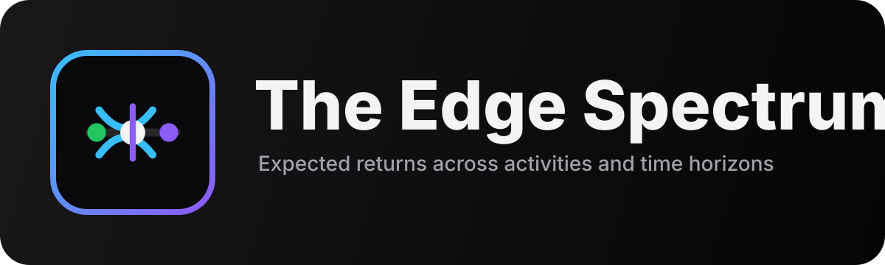

<a id="readme-top"></a>

# Edge Spectrum 🟢

<p align="center">
  <a href="https://edge-spectrum.mikesailab.com">
    
  </a>
</p>

<p align="center">
  <em>A unified multi-tool hub for sports betting, investing, gambling, and odds analysis.<br>Compare expected returns across time horizons, backtest sports wagering strategies over 25 simulated seasons, and analyze mathematical edges.</em>
</p>

<p align="center">
  <a href="Docs/README.md"><strong>Explore the docs »</strong></a>
</p>

<p align="center">
  <a href="https://edge-spectrum.mikesailab.com">View Live Hub</a>
  ·
  <a href="https://github.com/michaelschecht/edge-spectrum/issues">Report Bug</a>
  ·
  <a href="https://github.com/michaelschecht/edge-spectrum/issues">Request Feature</a>
</p>

<p align="center">
  <a href="https://edge-spectrum.mikesailab.com"></a>
  
  <a href="Docs/roadmap.md"></a>
</p>

<p align="center">
  
  
  
  
  
</p>

---

## 🚀 Overview

**Edge Spectrum** is an interactive playground for exploring mathematical edges. It brings together two core analytical applications:

1. **The Edge Spectrum Expected-Return Visualizer** (`/spectrum/`): Compares **187 financial, investing, trading, and gambling activities** over **7 time horizons** (Single Event to 10 Years), standardized using the **DU/CED framework**. Return on capital is the primary axis and is floored at −100%; the unbounded turnover cost gets its own axis so the two are never compared as if they were the same quantity.
2. **The Backtest Simulator** (`/backtester`): Backtests sports wagering strategies across **25 simulated seasons of MLB, NFL, NHL, and NBA games** (2000–2025), providing ROI diagnostics, equity curves, live ESPN scores, and an **AI Strategy Advisor** powered by Gemini.

---

## 🛠️ Applications & Features

### 1. The Edge Spectrum Expected-Return Visualizer
Served as a static page at `/spectrum/index.html` (internally routes to `public/spectrum/index.html`).

- **13 Asset/Bet Categories:** Stocks, Bonds, Real Estate, Crypto, Precious Metals, Collectibles, Insurance/Annuities, Sports Betting, Casino, Poker, Prediction Markets, and Lottery.
- **Universal DU/CED Framework:** Standardized expected returns via:
  $$\text{Expected Turnover Cost} = \text{Decision Units (DU)} \times \text{Capital Exposure per Decision (CED)} \times \text{Edge}$$
- **Three named measures, never mixed on one axis:**
  - **Return on Capital** *(primary)* — what happens to the one bankroll you brought. Held assets compound; wagering activities accrue their flat-stake loss and stop at **−100%**, because a bankroll cannot lose more than itself.
  - **Expected Turnover Cost** *(secondary axis, wagering activities only)* — the DU/CED product above: cumulative expected loss as a multiple of the starting bankroll, deliberately **unbounded**, because it assumes you keep reloading.
  - **Ruin Point** — decisions until the bankroll is expected to reach $0 (years to −90% for a losing held asset).
- **Interactive Controls:** Toggle any combination of categories, switch measure (On Capital / Turnover Cost), adjust time horizons (Single Event to 10 Years), switch overlays (Raw Returns, Fee-Adjusted, After-Tax).
- **Ruin Point Overlay** *(on by default)*: a dotted −100% floor line on the primary chart, an ✕ per activity whose bankroll is gone before the horizon ends, a **Ruined By Horizon** counter, and per-activity decisions-to-$0 and time-to-ruin in the tooltip.
- **Addiction Risk Scoring:** Color-coded border alerts based on feedback loops and documentation of problem behavior.
- **Dollar Cost Comparison** *(toggle present but non-functional — regressed in V19, see [change_log.md](Docs/change_log.md))*: intended to translate percentages into dollar outcomes at $100/week.

### 2. The Sports Wagering Backtester
Served inside the SPA React shell at `/backtester`.

- **25 Simulated Historical Seasons:** Calibrated power-rating simulation for MLB, NFL, NHL, and NBA (2000–2025) with empirical distribution-based market pricing.
- **Custom Strategy Builder:** Define wager filters based on home/away status, bookmaker odds (favorites/underdogs), and custom edge margins.
- **Position Sizing Models:** Standard flat betting vs. Kelly Criterion sizing (Full/Fractional).
- **Interactive Reports:** Analyze cumulative profit curves, win rates, ROI, Kelly diagnostics, and drawdowns.
- **Live Scoreboard integration:** Pulls real-time ESPN scoreboard updates.
- **Gemini AI Strategy Advisor:** Iterates on backtest results to suggest portfolio optimizations, staking alterations, or parameter tuning.

---

## 🏗️ Repository Architecture

```
edge-spectrum/
├── site/                  # ← THE WEB APP (Vercel Root Directory = site)
│   ├── api/               # Vercel serverless functions (backtest, ESPN, Gemini advisor)
│   ├── public/
│   │   ├── favicon.svg    # The served app icon
│   │   └── spectrum/      # The Edge Spectrum static Plotly visualization page
│   ├── src/
│   │   ├── components/    # Backtester UI components (AiAdvisor, StrategyBuilder, ProfitChart, etc.)
│   │   ├── pages/
│   │   │   └── Home.tsx   # Landing page (dashboard tile grid mapping over tools.ts)
│   │   ├── server/        # Shared backend engines (backtest, ESPN score, Gemini prompt engines)
│   │   ├── data/edges.ts  # The Dataset — SINGLE SOURCE OF TRUTH for all 187 edge records
│   │   ├── App.tsx        # Main router shell & top-nav bar
│   │   ├── main.tsx       # React bootstrap
│   │   └── tools.ts       # The Registry — SINGLE SOURCE OF TRUTH for all tools
│   ├── scripts/           # Guards & generators (check:market, check:spectrum, gen:edges)
│   ├── server.ts          # Express local dev server (proxies/runs Vite + serverless local engines)
│   ├── package.json       # Scripts & node dependencies
│   └── vercel.json        # Vercel configuration (SPA routing overrides & API serverless mappings)
├── Docs/                  # In-depth logs, standardized analysis, and future ideas
├── Data/                  # edge_dataset.md (generated from edges.ts) + frozen legacy catalogs
├── Images/                # Logos, icons, screenshots, and favicon.svg (archived copy of the app icon)
└── Versions/              # Legacy and alternate versions (Streamlit port, original themes)
```

> **Note:** everything the site needs lives under `site/`; the repo root holds only docs and archives.
> Run all app commands (`npm …`, `vercel …`) from inside `site/`.

---

## ⚡ Quick Start (Local Development)

### 1. Prerequisites
- **Node.js** (v18+ recommended)
- **Gemini API Key** (to enable the AI Advisor)

### 2. Installation
Clone the repository, then install the dependencies from the `site/` directory (where the app lives):
```bash
cd site
npm install
```

### 3. Environment Setup
Create a `.env` file inside `site/`:
```env
GEMINI_API_KEY=your_gemini_api_key_here
PORT=3001
```

### 4. Running the Development Server
Starts the local Express server at `http://localhost:3001` with Vite middleware for React hot-reloading:
```bash
npm run dev
```

### 5. Build and Test Production Build
```bash
npm run build
npm start
```

---

## 🔌 Adding a New Tool

To add a new tool to the Edge Spectrum hub, follow the **three-step recipe**:

1. **Register the Tool:** Add an entry to the `TOOLS` array in [tools.ts](file:///D:/AI_Agents/Projects/Mikes_AI_Lab/Repos/Live_Apps/edge-spectrum/site/src/tools.ts):
   ```typescript
   {
     slug: 'my-new-tool',
     title: 'My Custom Tool',
     blurb: 'Brief description of the tool...',
     icon: MyIconName,
     href: '/my-new-tool', // or direct static path
     kind: 'route',        // 'route' | 'static' | 'external'
     status: 'live',       // 'live' | 'wip' | 'soon'
     accent: 'violet',     // Color scheme name
     tag: 'Utility'
   }
   ```
2. **Mount the Code:**
   - **`route` kind:** Build the page component under `site/src/pages/MyNewTool.tsx` and add its `<Route>` path inside [App.tsx](file:///D:/AI_Agents/Projects/Mikes_AI_Lab/Repos/Live_Apps/edge-spectrum/site/src/App.tsx).
   - **`static` kind:** Put your HTML/CSS/JS folder inside `site/public/my-new-tool/` and link its `href` to `/my-new-tool/index.html`.
   - **`external` kind:** Set `href` to the external destination URL (it will open in a new tab).
3. **Accent Setup:** Ensure the selected `accent` name exists inside the Tailwind literal mapping inside [Home.tsx](file:///D:/AI_Agents/Projects/Mikes_AI_Lab/Repos/Live_Apps/edge-spectrum/site/src/pages/Home.tsx) so the JIT compiler generates the appropriate borders and glows.

---

## 🚀 Deployment

The site is hosted on **Vercel** (`edge-spectrum.mikesailab.com`). The Vercel project's **Root Directory is set to `site`**, so it builds from the app subdirectory.

- **Production branch:** `main` (automatically deployed on push/merge).
- **Local deployment check:** You can use the Vercel CLI (run from `site/`) to verify preview environments before merging:
  ```bash
  cd site
  vercel deploy
  ```

---

## ⚠️ Disclaimer

Expected returns are modeled averages derived from historical market data, bookmaker averages, and retail-trader statistics. Individual results vary drastically due to short-term variance.

> [!CAUTION]
> **For educational purposes only.** This tool does not constitute investment or gambling advice.

---

<p align="center">
  <sub>Managed by Mike's AI Lab · Standalone HTML/CSS/Plotly viz and React/Vite dashboard</sub><br>
  <sub><b>GAMBLING: LINEAR DECAY · INVESTING: COMPOUND APPRECIATION</b></sub>
</p>
